# Deployment Plan

## Goal
Make the web app deployment ready by implementing the following:

1. Implement Google Cloud Datastore for persistent data storage.
2. Implement Stripe integration for payment processing.
3. Implement more robust rate limiting using Cloudflare's features.

## Plan Details

### 1. Implement Google Cloud Datastore
- **Action:** Create a Google Cloud Datastore instance.
- **Action:** Create data models in `backend/models/` for users, businesses, features, subscriptions, and chats to be stored in Datastore.
- **Action:** Update the `backend/auth.py` file to store and retrieve user data from Google Cloud Datastore instead of the mock `USERS` dictionary.
- **Action:** Update the `backend/business.py`, `backend/features.py`, and `backend/subscription.py` files to store and retrieve data from Google Cloud Datastore.
- **Action:** Add the `google-cloud-datastore` library to `backend/requirements.txt`.

### 2. Implement Stripe Integration
- **Action:** Create a Stripe account (if not already created).
- **Action:** Obtain Stripe API keys (secret and publishable keys).
- **Action:** Update the `backend/auth.py` file to integrate with the Stripe API for processing payments during subscription and credit purchases.
- **Action:** Add the `stripe` library to `backend/requirements.txt`.

### 3. Implement Robust Rate Limiting
- **Action:** Configure Cloudflare's rate limiting rules in the Cloudflare dashboard to protect the API endpoints from abuse. This will likely involve setting rules based on request origin, request type, and request frequency.

## Mermaid Diagram

```mermaid
graph TD
    A[Start] --> B{Implement Google Cloud Datastore};
    B --> C{Create a Google Cloud Datastore instance};
    C --> D{Create data models for users, businesses, features, subscriptions, and chats};
    D --> E{Update the auth.py file to store user data in Google Cloud Datastore};
    E --> F{Update the business.py, features.py, and subscription.py files to store data in Google Cloud Datastore};
    F --> G{Update the requirements.txt file to include the google-cloud-datastore library};
    G --> H{Implement Stripe integration};
    H --> I{Create a Stripe account};
    I --> J{Create a Stripe API key};
    J --> K{Update the auth.py file to process payments using the Stripe API};
    K --> L{Update the requirements.txt file to include the stripe library};
    L --> M{Implement more robust rate limiting};
    M --> N{Configure Cloudflare's rate limiting rules to prevent abuse};
    N --> O[End];
```

## Next Steps

After reviewing this plan, switch to code mode to begin implementation.