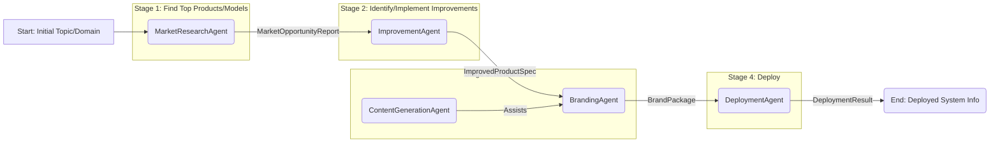

# Autonomous Income Generation Workflow: Architecture Design

This document outlines the proposed architecture for the 4-step workflow (Find, Improve, Rebrand, Deploy) using ADK agents and A2A communication.

**1. Workflow Stages & Data Flow**

The workflow consists of four sequential stages. Each stage takes input from the previous one and produces output for the next.



**Data Flow & Structures:**

*   **Input:** `InitialTopic` (string): A keyword, domain, or description defining the area of interest.
*   **Stage 1 Output / Stage 2 Input:** `MarketOpportunityReport` (JSON/Dict):
    *   `competitors`: List of identified competitors (URLs, descriptions).
    *   `analysis`: Structured analysis (market gaps, competitor weaknesses, pricing strategies).
    *   `feature_recommendations`: List of potential features based on analysis.
    *   `target_audience_suggestions`: Potential target demographics.
*   **Stage 2 Output / Stage 3 Input:** `ImprovedProductSpec` (JSON/Dict):
    *   `product_concept`: Description of the core product/model.
    *   `target_audience`: Defined target demographics.
    *   `key_features`: List of core features (potentially derived from Stage 1).
    *   `identified_improvements`: Specific improvements or unique selling propositions identified (based on `feature.manager.py` logic).
    *   `implementation_difficulty` (optional): Estimated difficulty score.
    *   `revenue_impact` (optional): Estimated revenue impact.
*   **Stage 3 Output / Stage 4 Input:** `BrandPackage` (JSON/Dict):
    *   `brand_name`: Selected brand name.
    *   `tagline`: Generated tagline.
    *   `color_scheme`: Primary, secondary, accent colors (hex codes).
    *   `positioning_statement`: Brand positioning text.
    *   `key_messages`: Core marketing messages.
    *   `voice_tone`: List of brand voice characteristics.
*   **Stage 4 Output:** `DeploymentResult` (JSON/Dict):
    *   `deployment_url`: Simulated URL of the deployed product/service.
    *   `status`: Deployment status (e.g., "ACTIVE").
    *   `brand_name`: Brand name used.
    *   `features_deployed`: List of features included in the deployment.
    *   `deployment_details`: Simulated hosting info, resources, etc.

*(Note: These structures can be formalized using Pydantic models based on `backend/models` if needed during implementation.)*

**2. Agent Roles & Refactoring**

We will define specific ADK agents, refactoring existing logic where appropriate.

*   **`MarketResearchAgent` (Stage 1):**
    *   **Responsibility:** Analyze the initial topic/domain, identify competitors, analyze their offerings, and generate the `MarketOpportunityReport`.
    *   **Refactoring Source:** `backend/agents/prototypes/competitor_intelligence_agent_team/competitor_agent_team.py`. This involves extracting the core logic for competitor discovery (Exa) and analysis (Firecrawl, LLM analysis) into a single, callable ADK agent service. The multi-agent complexity within the prototype might be simplified into a single agent interface for this workflow.
    *   **Existing Agents:** May leverage `WebSearchAgent` internally if needed. Supersedes the general `MarketAnalysisAgent` for this specific workflow's initial stage.

*   **`ImprovementAgent` (Stage 2):**
    *   **Responsibility:** Take the `MarketOpportunityReport`, analyze potential features/improvements based on the identified gaps and business model type, and produce the `ImprovedProductSpec`.
    *   **Refactoring Source:** `backend/modules/feature.manager.py`. Encapsulate the logic from `identify_revenue_features` and potentially adapt it to suggest improvements based on competitor weaknesses or market gaps identified in Stage 1.
    *   **Other Agents:** No direct dependency, but the output defines the product to be branded and deployed.

*   **`BrandingAgent` (Stage 3):**
    *   **Responsibility:** Generate a complete brand identity (`BrandPackage`) based on the `ImprovedProductSpec`, including name, tagline, colors, and positioning.
    *   **Refactoring Source:** `backend/modules/branding.py`. Wrap the functions (`generate_brand_name`, `generate_color_scheme`, `generate_positioning`, `create_complete_branding`) into an ADK agent service.
    *   **Existing Agents:** Can collaborate with `ContentGenerationAgent`. The `BrandingAgent` generates the core elements, and the `ContentGenerationAgent` could be invoked (potentially by the orchestrator or the `BrandingAgent` itself) to refine taglines, write detailed marketing copy, or generate alternative positioning statements based on the `BrandPackage`.

*   **`DeploymentAgent` (Stage 4):**
    *   **Responsibility:** Simulate the deployment of the product defined in `ImprovedProductSpec` with the branding from `BrandPackage`, returning the `DeploymentResult`.
    *   **Refactoring Source:** `backend/modules/deployment.py`. Convert the `DeploymentManager` class and its methods (`deploy_system`, `get_deployment_status`) into an ADK agent service.
    *   **Other Agents:** No direct dependencies for this simulation stage.

*   **`ProductCloningAgent` (Potential Future Agent):**
    *   **Consideration:** Depending on the strategy, an agent could be added (likely before Stage 2) to attempt cloning a competitor's product based on the `MarketOpportunityReport`. This is out of the current scope but a potential extension.

**3. Orchestration**

*   **Orchestrator:** A dedicated **`WorkflowManagerAgent`** should be created specifically for managing this 4-step workflow. This keeps the main `OrchestratorAgent` focused on higher-level task delegation. The main `OrchestratorAgent` could initiate this workflow by calling the `WorkflowManagerAgent`.
*   **Initiation:** The workflow can be triggered via:
    *   A specific API endpoint (e.g., `/workflows/start_income_generation`).
    *   A command recognized by the main `OrchestratorAgent`.
    *   A scheduled task (if desired later).
*   **Progress Tracking:** The `WorkflowManagerAgent` will maintain the state of the workflow, including:
    *   The current stage (e.g., `PENDING`, `STAGE1_COMPLETE`, `STAGE2_COMPLETE`, etc.).
    *   The data generated by each completed stage (`MarketOpportunityReport`, `ImprovedProductSpec`, etc.).
    *   It invokes the appropriate agent for the current stage via A2A communication.
    *   Upon successful completion of a stage, it updates the state and triggers the next agent.
    *   It should handle potential errors from agents and manage retries or failure states.

**4. A2A Communication**

*   **Mechanism:** **REST APIs** are recommended for this linear workflow. Each agent (`MarketResearchAgent`, `ImprovementAgent`, `BrandingAgent`, `DeploymentAgent`) will expose a simple REST endpoint (e.g., `/run`, `/execute`).
    *   **Justification:** REST is straightforward to implement for point-to-point communication in a sequential process. It avoids the complexity of setting up and managing a message queue for this specific workflow, which doesn't have complex fan-out or asynchronous decoupling needs *between these specific stages*. If the system grows significantly more complex, transitioning to a message queue (like RabbitMQ or Redis Pub/Sub) could be reconsidered for better scalability and decoupling.
*   **Basic Message Format / API Contract:**
    *   **Request (WorkflowManagerAgent -> Specific Agent):**
        ```json
        POST /run
        Content-Type: application/json

        {
          "task_id": "workflow_instance_123", // Unique ID for this workflow run
          "stage": "stage_1_market_research", // Identifier for the current task/stage
          "input_data": {
            // Data required by the agent, e.g., for Stage 2:
            // "market_opportunity_report": { ... }
          }
        }
        ```
    *   **Response (Specific Agent -> WorkflowManagerAgent):**
        ```json
        HTTP/1.1 200 OK
        Content-Type: application/json

        {
          "task_id": "workflow_instance_123",
          "status": "success", // or "failure"
          "result": {
            // Output data from the agent, e.g., MarketOpportunityReport
            // "competitors": [...], "analysis": {...}
          },
          "error_message": null // or details on failure
        }
        ```

**5. Outline Refactoring Summary**

The following existing components need to be refactored/wrapped into ADK-compliant agent services:

1.  `backend/agents/prototypes/competitor_intelligence_agent_team/competitor_agent_team.py` -> `MarketResearchAgent`
2.  `backend/modules/feature.manager.py` -> `ImprovementAgent`
3.  `backend/modules/branding.py` -> `BrandingAgent`
4.  `backend/modules/deployment.py` -> `DeploymentAgent`
5.  A new `WorkflowManagerAgent` needs to be created to orchestrate these agents.